CS19108RA4156
=============

Chipsee Products Naming Rules
-----------------------------

+-----------------------+-----------------------------------------------------+
| CS19108RA4156A-C111   |                                                     |
+=======================+=====================================================+
| CS                    | **Chipsee Product Abbreviate**                      |
+-----------------------+-----------------------------------------------------+
| 19                    | **Horizontal Resolution**                           |
|                       |                                                     |
|                       | **80** Means 800 Pixel                              |
|                       |                                                     |
|                       | **10** Means 1024 Pixel                             |
|                       |                                                     |
|                       | **12** Means 1280 Pixel                             |
|                       |                                                     |
|                       | **14** Means 1440 Pixel                             |
|                       |                                                     |
|                       | **19** Means 1920 Pixel                             |
+-----------------------+-----------------------------------------------------+
| 108                   | **Vertical Resolution**                             |
|                       |                                                     |
|                       | **480** Means 480 Pixel                             |
|                       |                                                     |
|                       | **600** Means 600 Pixel                             |
|                       |                                                     |
|                       | **768** Means 768 Pixel                             |
|                       |                                                     |
|                       | **800** Means 800 Pixel                             |
|                       |                                                     |
|                       | **900** Means 900 Pixel                             |
|                       |                                                     |
|                       | **102** Means 1024 Pixel                            |
|                       |                                                     |
|                       | **108** Means 1080 Pixel                            |
+-----------------------+-----------------------------------------------------+
| RA4                   | **Based on Raspberry CM4**                          |
+-----------------------+-----------------------------------------------------+
| 156                   | **LCD Dimension**                                   |
|                       |                                                     |
|                       | **050** Means 5.0 Inch                              |
|                       |                                                     |
|                       | **070** Means 7.0 Inch                              |
|                       |                                                     |
|                       | **080** Means 8.0 Inch                              |
|                       |                                                     |
|                       | **097** Means 9.7 Inch                              |
|                       |                                                     |
|                       | **101** Means 10.1 Inch                             |
|                       |                                                     |
|                       | **104** Means 10.4 Inch                             |
|                       |                                                     |
|                       | **120** Means 12.0 Inch                             |
|                       |                                                     |
|                       | **150** Means 15.0 Inch                             |
|                       |                                                     |
|                       | **156** Means 15.6 Inch                             |
|                       |                                                     |
|                       | **170** Means 17.0 Inch                             |
|                       |                                                     |
|                       | **190** Means 19.0 Inch                             |
|                       |                                                     |
|                       | **215** Means 21.5 Inch                             |
+-----------------------+-----------------------------------------------------+
| A                     | **Means Embedded PC or Panel PC**                   |
|                       |                                                     |
|                       | **E** Means Embedded PC without Case                |
|                       |                                                     |
|                       | **P** Means Panel PC with Case                      |
|                       |                                                     |
|                       | **A** Means All-In-One Computer with Plastic Case   |
+-----------------------+-----------------------------------------------------+
| C                     | **Means Touch Type**                                |
|                       |                                                     |
|                       | **R** Means Resistive Touch                         |
|                       |                                                     |
|                       | **C** Means Capacitive Touch                        |
+-----------------------+-----------------------------------------------------+
| 1                     | **Means LCD Brightness**                            |
|                       |                                                     |
|                       | **1** Means Common Brightness                       |
|                       |                                                     |
|                       | **2** Means High Brightness                         |
+-----------------------+-----------------------------------------------------+
| 1                     | **PCB Version**                                     |
|                       |                                                     |
|                       | Baseboard PCB Version Number                        |
+-----------------------+-----------------------------------------------------+
| 1                     | **PCB Version**                                     |
|                       |                                                     |
|                       | CM4 Version Number                                  |
+-----------------------+-----------------------------------------------------+

Hardware Features
-----------------

+----------------------------+----------------------------------------------------------------------------------+
| Key Features:              |                                                                                  |
+============================+==================================================================================+
| **CPU Module**             | Raspberry Pi CM4 Lite, Quad Cortex-A72 at 1.5GHz.                                |
+----------------------------+----------------------------------------------------------------------------------+
| **Storage**                | TF card slot for boot. Internal M.2 NVMe connector for SSD card.                 |
+----------------------------+----------------------------------------------------------------------------------+
| **RAM**                    | Default 2GB, can also be 1/4/8GB based on CM4 Lite on board                      |
+----------------------------+----------------------------------------------------------------------------------+
| **Display**                | 15.6 Inch IPS LCD, 1920\*1080 Pixel Resolutions. Brightness: 250nit.             |
+----------------------------+----------------------------------------------------------------------------------+
| **Touch**                  | Ten-Point Capacitive Touch with 1.0mm Armored Glass.                             |
+----------------------------+----------------------------------------------------------------------------------+
| **USB**                    | 2 x USB 3.0 Host connector, 1Type-C USB Slave connector.                         |
+----------------------------+----------------------------------------------------------------------------------+
| **LAN**                    | 1 Channel Giga LAN.                                                              |
+----------------------------+----------------------------------------------------------------------------------+
| **HDMI**                   | HDMI 2.0 connectors, slave HDMI port for CM4                                     |
+----------------------------+----------------------------------------------------------------------------------+
| **Audio**                  | 2W internal Stereo Speaker.                                                      |
|                            |                                                                                  |
|                            | 3.5mm Audio Out Connector.                                                       |
+----------------------------+----------------------------------------------------------------------------------+
| **Buzzer**                 | Internal Buzzer.                                                                 |
+----------------------------+----------------------------------------------------------------------------------+
| **RTC**                    | High accuracy internal RTC. The time can be kept for one week after power off.   |
+----------------------------+----------------------------------------------------------------------------------+
| **HAT connector**          | Standard Raspberry Pi 40 way HAT connector.                                      |
+----------------------------+----------------------------------------------------------------------------------+
| **Micro SD Card socket**   | For use only with CM4Lite modules                                                |
+----------------------------+----------------------------------------------------------------------------------+
| **WIFI/BT**                | This product uses the WIFI/BT on the CM4.                                        |
+----------------------------+----------------------------------------------------------------------------------+
| **Camera**                 | Camera on the front panel. **NOT** mounted on by default.                        |
+----------------------------+----------------------------------------------------------------------------------+
| **Power Input**            | 12V DC.                                                                          |
+----------------------------+----------------------------------------------------------------------------------+
| **Current @ 12V**          | 700 mA max                                                                       |
+----------------------------+----------------------------------------------------------------------------------+
| **Power Consumption**      | 8.4W Typical                                                                     |
+----------------------------+----------------------------------------------------------------------------------+
| **Working Temperature**    | 0°C to +50°C                                                                     |
+----------------------------+----------------------------------------------------------------------------------+
| **OS**                     | Debian, Ubuntu                                                                   |
+----------------------------+----------------------------------------------------------------------------------+
| **Certification**          | CE, ROSH                                                                         |
+----------------------------+----------------------------------------------------------------------------------+
| **Dimension**              | 374\*238\*33mm                                                                   |
+----------------------------+----------------------------------------------------------------------------------+
| **Plastic Case Color**     | Black                                                                            |
+----------------------------+----------------------------------------------------------------------------------+
| **Weight**                 | 1600g                                                                            |
+----------------------------+----------------------------------------------------------------------------------+

CS19108RA4156 
-------------

|image1|

Figure 1 Top View (Debian)

|image2|

Figure 2 Back View

|image3|

Figure 3 Side View, Connector Function

Power Input Connector
---------------------

The product CS19108RA4156A uses power input: **DC 12V**. The total power
consumption is about **8.4W** typically. The Power supply must have a
2.1mm I.D x 5.5mm O.D x 9.5mm. Figure4 shows the matched DC Power
adapter connector.

|image4|

Figure 4 Power Adapter Connector

USB HOST and Type C
-------------------

This product has two channel USB3.0 Host and 1 channel Type-C connector
shows as Figure 3 shows. The USB3.0 HOST can connect USB Disk or USB
mouser, keyboard, and so on.

The Type-C Port only use for download software to the Raspberry Pi CM4
eMMC. And the USB3.0 HOST will be disabled automatically when the Type-C
Port connected.

HDMI
----

The CM4 supports Dual HDMI 2.0 connectors, we use Master HDMI as LCD
display and customer can use Slave HDMI port, as Figure 3 shows.

LAN Connector
-------------

This product has a Giga LAN connector, as Figure 3 shows.

TF Card
-------

This product has a TF Card slot, as Figure 3 shows.

.. Warning::
   For use only with CM4Lite modules.

Audio Out Connector
-------------------

This product has an audio Out Connector, as Figure 3 shows.

Camera
------

The product CS19108RA4156A supports Camera on PCB. But the Camera is not
mounted by default.

40Pin Expansion Connector
-------------------------

The product CS19108RA4156A has a standard Raspberry Pi 40 way HAT
connector, as Figure 5 shows.

You also can check `https://pinout.xyz <https://pinout.xyz>`__ to know
detail.

|image5|

|image6|

Figure 5 40pin Expansion Connector

Status LED
----------

This product has a status LED on the front panel. The LED will be
**RED** after power on, and will be **Green** when the system booted,
and can be controlled by software to flash **YELLOW** when CPU working.

Buttons
-------

There are 5 Buttons on the front panel, they work as Power, Brightness+,
Brightness-, Audio output Volume+, Volume-. As Figure 6 shows.

The product CS19108RA4156A supports 2 boot modes, auto boot and manual
boot, default configuration is auto boot mode. We can change the boot
mode by using Software or Push Volume+ and Volume- buttons at same time
before power on, and release it 3 Seconds after power on to toggle, as
Table 1 shows.

Table 1 Boot mode

+-------------+----------------------------------------------------------------------------+-------------------------+-------------------------------------------------------------------------------------------------------------------------------+
| Boot mode   | Behaviors                                                                  | Default Configuration   | How to toggle                                                                                                                 |
+=============+============================================================================+=========================+===============================================================================================================================+
| Auto        | Auto boot after power on                                                   | √                       | Software control or Push Volume+ and Volume- buttons at same time before power on, and release it 3 Seconds after power on.   |
+-------------+----------------------------------------------------------------------------+-------------------------+-------------------------------------------------------------------------------------------------------------------------------+
| Manual      | Boot after push the Power button and release it 3 Seconds after power on   |                         |                                                                                                                               |
+-------------+----------------------------------------------------------------------------+-------------------------+-------------------------------------------------------------------------------------------------------------------------------+

The product CS19108RA4156A boot from the internal eMMC by default. If
you want it boot from the Type-C connector, please PUSH the Volume+
button **BEFORE** power on, and release it **3 Seconds** after power on.
Then this product will boot from Type-C.

You can use Brightness+ / Brightness- to control the backlight of LCD.

You also can use Volume+ / Volume- to control the System Volume.

For detail buttons functions, check Table 2.

Table 2 Buttons Functions

+-----------------------+-------------------------------------------------------------------------------------+------------------------------------------------------------------------+
| Buttons               | Functions before system booted                                                      | Functions after system booted                                          |
+=======================+=====================================================================================+========================================================================+
| Power                 | Push after power on and release it 3 Seconds will boot system.                      | Push after system booted and release it 3 Seconds will close system.   |
+-----------------------+-------------------------------------------------------------------------------------+------------------------------------------------------------------------+
| Brightness+           | NULL                                                                                | Increase the brightness of LCD                                         |
+-----------------------+-------------------------------------------------------------------------------------+------------------------------------------------------------------------+
| Brightness-           | NULL                                                                                | Reduce the brightness of LCD                                           |
+-----------------------+-------------------------------------------------------------------------------------+------------------------------------------------------------------------+
| Volume+               | Push before power on and release it 3 Seconds, system will boot from Type-C port.   | Increase the Volume of system                                          |
+-----------------------+-------------------------------------------------------------------------------------+------------------------------------------------------------------------+
| Volume-               | NULL                                                                                | Reduce the Volume of system                                            |
+-----------------------+-------------------------------------------------------------------------------------+------------------------------------------------------------------------+
| Volume+ and Volume-   | Toggle the boot mode                                                                | NULL                                                                   |
+-----------------------+-------------------------------------------------------------------------------------+------------------------------------------------------------------------+

|image7|

Figure 6 The Buttons

Measurements
------------

The measurement of CS19108RA4156A-C111 is 375\*238\*32.63mm, as Figure
7~9 shows.

The product CS19108RA4156A-C111 can be mounted by 75mm\*75mm VESA hole.

|image8|

Figure 7 Front Panel Dimension

|image9|

Figure 8 Backside Dimension

|image10|

Figure 9 Sideview Dimension

Mounting
--------

1. Stand Mounting, as Figure 10 shows:

|image11|

Figure 10 Stand Mounting

2. VESA Mounting, as Figure 11 shows. Be attention the base stand is not
   included by default.

|image12|

Figure 11 VESA Mounting

How to Get Support
------------------

Please feel free to contact us with any questions, queries or
suggestions.

If your question is about technical support or troubleshooting for one
of our products, we kindly ask you to first check our documentation for
a possible solution.

If you cannot find the solution you are looking for then please write to
service@\ chipsee.com providing all possible details.

|image13|

© Chipsee all right reserved.

Chipsee assumes no responsibility for any errors, which may appear in
this manual. Furthermore, Chipsee reserves the right to alter the
hardware, software, and/or specifications detailed herein at any time
without notice, and does not make any commitment to update the
information contained herein. Chipsee products are not authorized for
use as critical components in life support devices or systems.

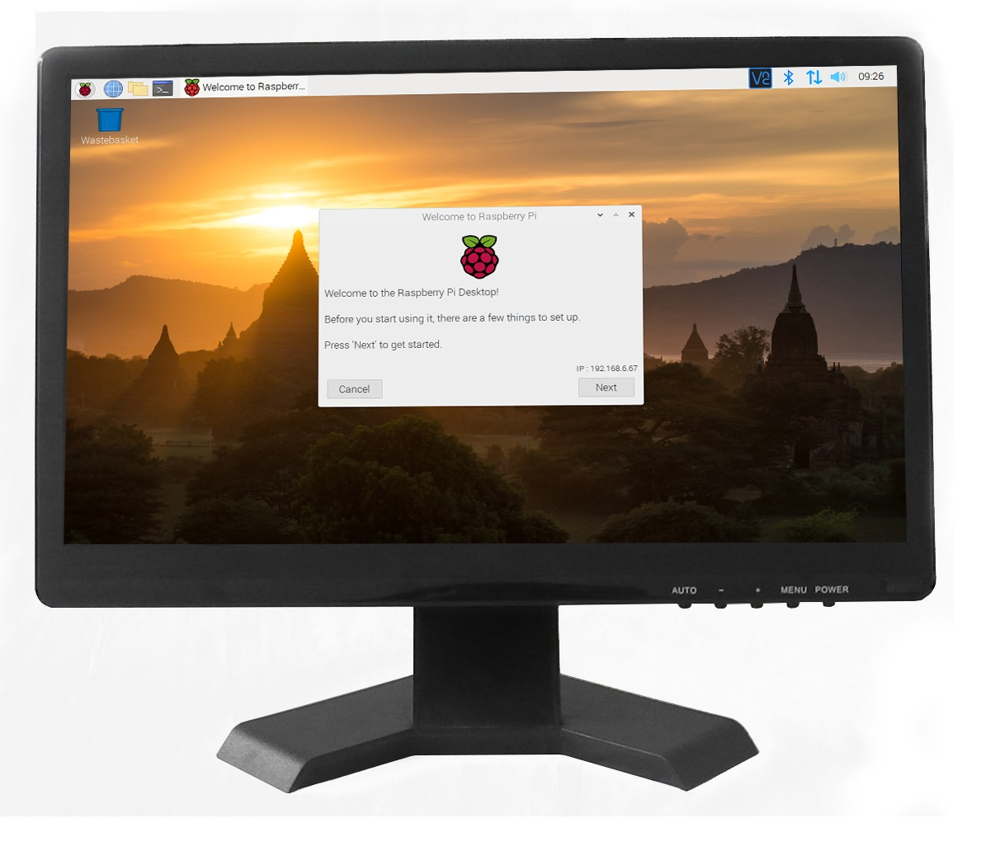
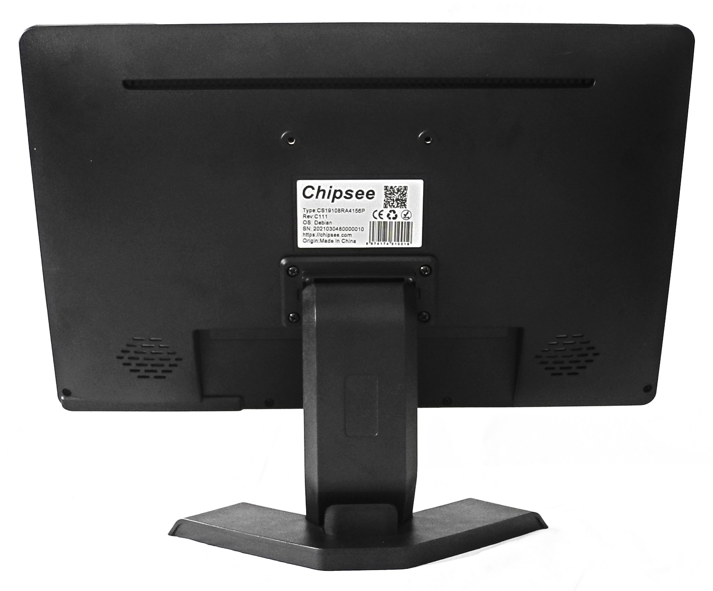
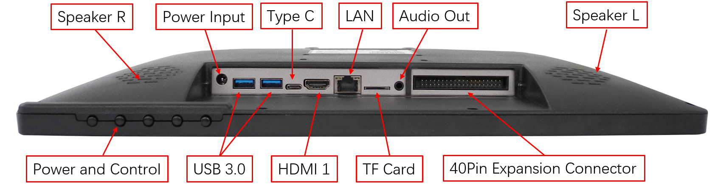
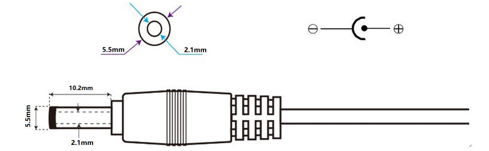
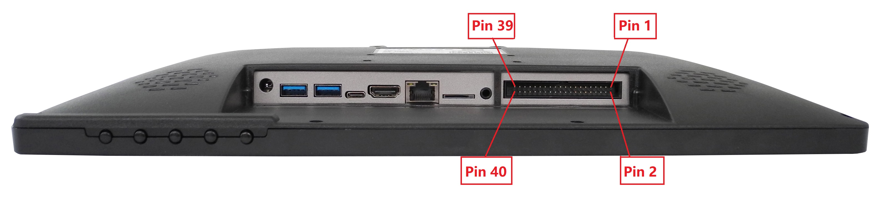
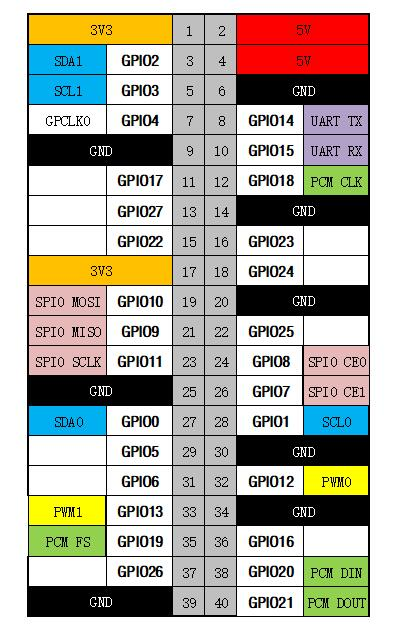
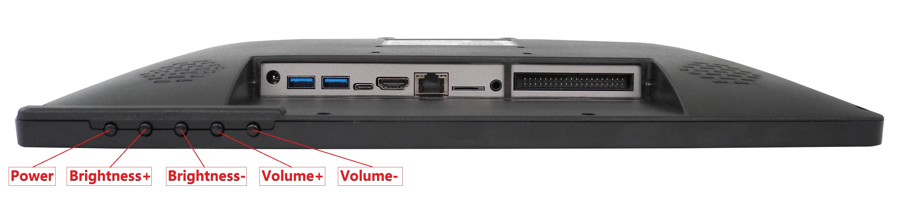
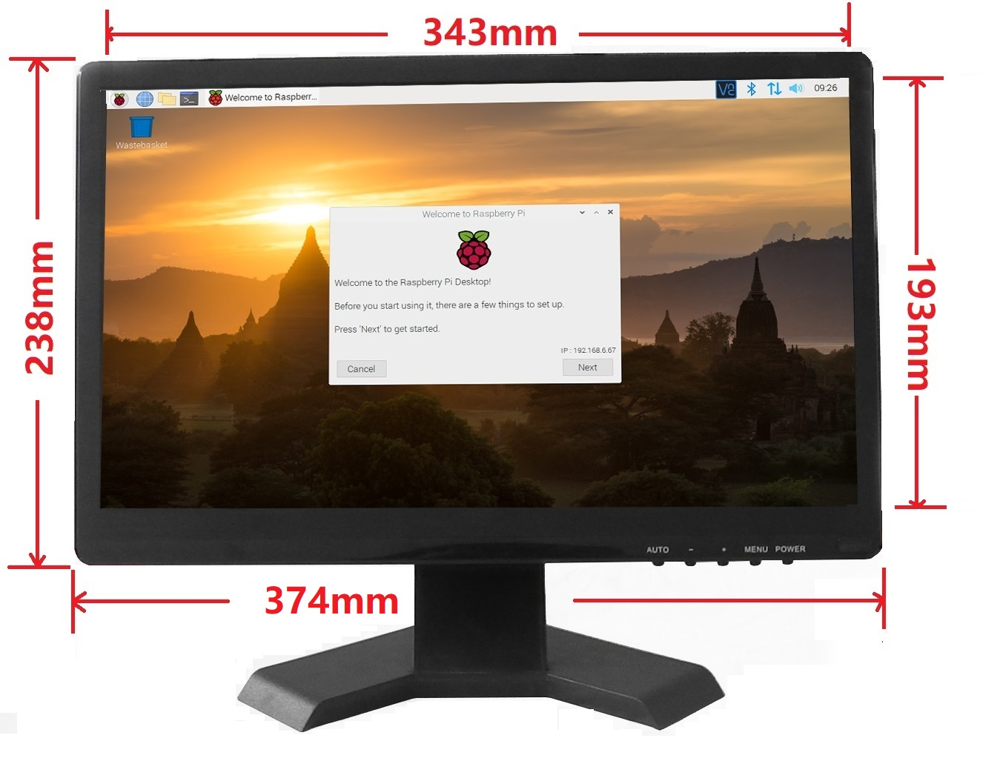
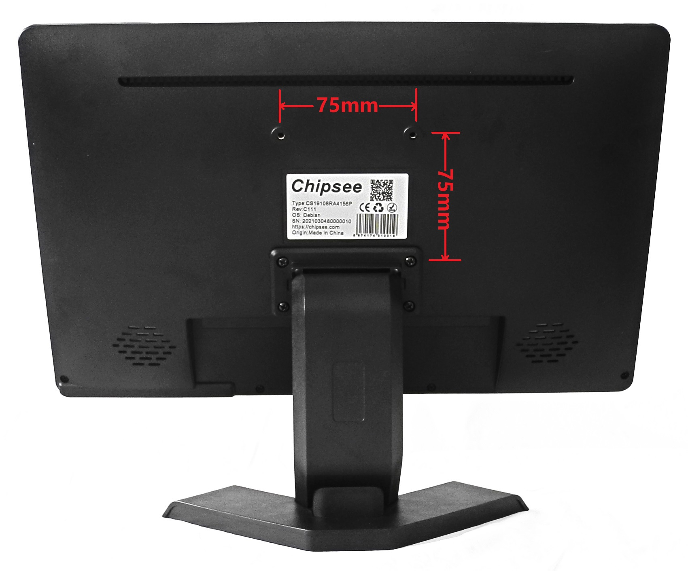
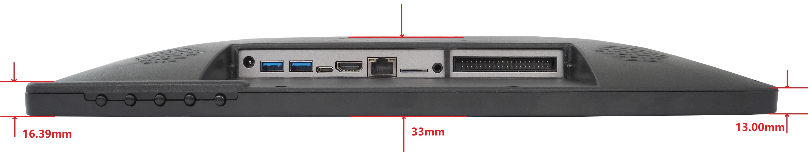

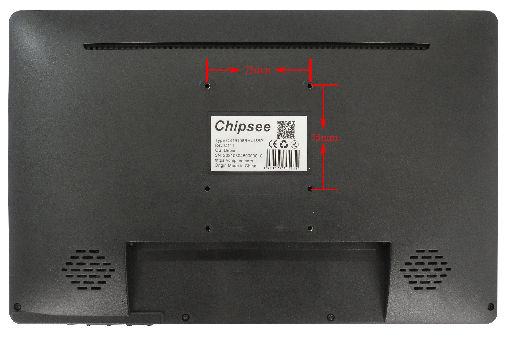

