Debian
======

About the Document
------------------

**Supported Board**

+--------------------------+
| **CS10600RA070**         |
|                          |
| **CS12800RA101-C111**    |
|                          |
| **CS10600RA4070**        |
|                          |
| **CS12800RA4101-C111**   |
+--------------------------+

**Supported Latest Images**

+--------------------------------------------------------------+
| **2020-12-02-raspios-buster-armhf-full-chipsee-v3.img.xz**   |
|                                                              |
| **2020-12-02-raspios-buster-armhf-chipsee-v3.img.xz**        |
|                                                              |
| **2020-12-02-raspios-buster-armhf-lite-chipsee-v3.img.xz**   |
+--------------------------------------------------------------+

System Features
---------------

+---------------------+--------------------------------+
| Feature             | Comment                        |
+=====================+================================+
| Kernel              | Kernel 5.4.79                  |
+---------------------+--------------------------------+
| System Version \*   | based on raspios 2020-12-02    |
+---------------------+--------------------------------+
| Python              | Python 2.7.16 / Python 3.7.3   |
+---------------------+--------------------------------+
| Qt                  | Need install By yourself       |
+---------------------+--------------------------------+
| GCC                 | 8.3.0                          |
+---------------------+--------------------------------+
| Debian Version      | Debian 10 (Buster)             |
+---------------------+--------------------------------+
| user/password       | [pi/raspberry]                 |
+---------------------+--------------------------------+

The system we used is based on raspberry official system; we add the
Chipsee hardware drivers on raspberry official system, for more
information please reference follow:

`https://github.com/Chipsee/industrial-pi <https://github.com/Chipsee/industrial-pi>`__

Prepare
-------

hardware
^^^^^^^^

-  Chipsee Raspberry Pi

-  6V ~ 36V Power Adapter (CS10600RA070 /CS10600RA4070 /CS12800RA101)

-  12V 2A Power Adapter(CS12800RA4101)

-  Mini-B USB OTG Cable (CS10600RA070 /CS12800RA101)

-  Micro-B USB Cable (CS10600RA4070 /CS12800RA4101)

-  USB to RS232 serial cable debug cable, the debug port use RS232
   protocol

-  SD Card (used for CM3 Lite , CM3+ Lite, CM4 Lite), 16GB at least

CS10600RA070 /CS10600RA4070 /CS12800RA101 need 6V ~ 36V Power
Adapter, you need prepare Power Adapter by yourself. CS12800RA4101
needs 12V 2A Power Adapter which we will provide, Mini-B and Micro-B
USB OTG Cable is used to download system images to board with
CM3/CM3+/CM4. USB to RS232 serial cable is used to debug the Chipsee
Raspberry Pi product. SD card is used to make bootable card. If you
use CM3 Lite/CM3 Lite+/CM4 Lite, you also need one SD card, 16GB at
least.

Software
^^^^^^^^

-  `7zip <http://www.7-zip.org/download.html>`__

-  Prebuilt Images

-  `balenaEtcher <https://www.balena.io/etcher/>`__

-  `rpiboot <https://github.com/raspberrypi/usbboot/raw/master/win32/rpiboot_setup.exe>`__

-  `Xshell <https://xshell.en.softonic.com>`__\ or other terminal
   emulation software

-  `VNC-Viewer <https://www.realvnc.com/en/connect/download/viewer/>`__

If you need change the system, you need 7zip/Prebuilt
image/balenaEtcher/rpiboot. You can use Xshell or other terminal
emulation software to debug Chipsee Raspberry Pi product in Windows. You
can use VNC-Viewer to control Chipsee Raspberry Pi product over
Ethernet.

Debug
-----

This document use Xshell to debug Chipsee Raspberry Pi product, you also
can use other tools, like Putty or other terminal emulation software.

Serial Debug
^^^^^^^^^^^^

The RS232\_0 on all Chipsee Raspberry Pi products is configured as debug
console default, you can use it to debug directly, and the default user
and password is [pi/raspberry]. Use follow session properties, like
Figure 2-1

|image0|

Figure 2-1 Session Properties

.. Note::
   If you need change the debug serial to normal serial, you can remove
   **console=ttyAMA0, 115200** in /boot/cmdline.txt and reboot.

SSH Debug
^^^^^^^^^

Connect Chipsee Raspberry Pi product to Internet, get the ip address.
Then config Xshell or use ssh tool in PC directly.

-  You need enable SSH feature in Chipsee Raspberry Pi product first.
   Run follow command in debug console::

   $ sudo raspi-config

.. Note::
   Select Interfacing Options -> SSH -> Yes

-  If you don’t have debug console, you also can use GUI feature to
   enable SSH.

|image1|

Figure 2-2 Configuration

|image2|

Figure 2-3 Configurations SSH

Now we will introduce Xshell ssh debug. First we need add one new
session, and then setting the session like figure 2-4

|image3|

Figure 2-4 SSH Setting

|image4|

Figure 2-5 SSH Debug

VNC Debug
^^^^^^^^^

You can use VNC-Viewer in Windows to control Chipsee Raspberry Pi
product over Ethernet.

-  You need enable VNC feature in Chipsee Raspberry Pi product. Run
   follow command in debug console.::

   $ sudo raspi-config

.. Note::
   Select Interfacing Options -> VNC -> Yes

-  If you don’t have debug console, you also can use GUI feature to
   enable VNC.

|image5|

Figure 2-6 Configurations

|image6|

Figure 2-7 Configurations VNC

-  Use VNC-Viewer in Windows to control it over Ethernet. Like figure
   2-8, 2-9, 2-10.

|image7|

Figure 2-8 Vnc-Viewer Connect

|image8|

Figure 2-9 authentications

|image9|

Figure 2-10 VNC Desktop

Downloading images
------------------

Booting switch configuration
^^^^^^^^^^^^^^^^^^^^^^^^^^^^

Chipsee Raspberry Pi product supports SD boot and eMMC boot
(CS12800RA4101 only support eMMC boot), it is based on your CM version,
if you use CM with eMMC, you can only use eMMC boot, if you use CM Lite
which has no eMMC, you can only use SD boot, the SD card should be
placed in SD0 slot. The SD1 slot is used as external storage.

**For CS10600RA070 /CS12800RA101 /CS10600RA4070**

When you need to download a new system to eMMC, you should configure
boot switch to **USB** position and insert Mini-B USB cable first, then
power the board. This will enable eMMC to work as one USB storage. After
the eMMC flashed, you need to configure boot switch to **eMMC** position
again

When you need use SD boot, you should configure boot switch to **eMMC**
position will be ok.

**For CS12800RA4101**

When you need download new system to eMMC, you should insert Micro-B USB
cable and press power button first, then power board will enable eMMC
works as one USB storage.

Checks follow to know detail steps.

Prebuilt image
^^^^^^^^^^^^^^

Chipsee Raspberry Pi product use Raspberry Pi official system as base
and add some modules and drivers. You can get the driver and latest
image from follow link:

`https://github.com/Chipsee/industrial-pi#latest-system-images <https://github.com/Chipsee/industrial-pi#latest-system-images>`__

If you're not using balenaEtcher, you'll need to unzip .img.xz file and
get the image file (.img) to write to your SD card.

Writing images to the SD card
^^^^^^^^^^^^^^^^^^^^^^^^^^^^^

Before you start, don't forget to check your SD card size (at least
16GB).

You will need to use an image writing tool to install the image you have
downloaded on your SD card.

balenaEtcher is a graphical SD card writing tool that works on Mac OS,
Linux and Windows, and is the easiest option for most users.
balenaEtcher also supports writing images directly from the .img.xz
file, without any unzipping required. To write your image with
balenaEtcher:

Download the latest version of balenaEtcher and install it.

-  Connect an SD card reader with the SD card inside.

-  Open balenaEtcher and select from your hard drive the Raspberry Pi
   .img.xz file you wish to write to the SD card.

-  Select the SD card you wish to write your image to.

-  Review your selections and click 'Flash!' to begin writing data to
   the SD card.

Note: for Linux users, zenity might need to be installed on your machine
for balenaEtcher to be able to write the image on your SD card.

Writing images to the eMMC
^^^^^^^^^^^^^^^^^^^^^^^^^^

Before you start, don’t forget to check your eMMC size, and select one
image. you also need to install
`rpitools <https://github.com/raspberrypi/usbboot/raw/master/win32/rpiboot_setup.exe>`__
to enable eMMC as one USB storage in your PC.

Under Windows, an installer is available to install the required drivers
and boot tool automatically. For those who just want to enable the
Compute Module eMMC as a mass storage device under Windows, the
stand-alone installer is the recommended option. Yes, the installer is
`rpitools <https://github.com/raspberrypi/usbboot/raw/master/win32/rpiboot_setup.exe>`__.

-  Download and run the Windows installer `rpitools
   <https://github.com/raspberrypi/usbboot/raw/master/win32/rpiboot_setup.exe>`__\ to
   install the drivers and boot tool.

    **For CS10600RA070 /CS12800RA101 /CS10600RA4070**

-  Plug your host PC Mini-B USB into the USB Downloader port, making
   sure boot switch is set to the USB position.

    **For CS12800RA4101**

-  Plug your host PC Micro-B USB into the USB Slave port (can be also
   called a USB Download Port), press the power button and keep it
   pressed.

-  Apply power to the board; Windows should now find the hardware and
   install the driver. For CS12800RA4101, you can loosen your hand now.

-  Once the driver installation is complete, run the RPiBoot.exe tool
   that was previously installed. You can run RPiBoot.exe in Windows
   PowerShell, like Figure 3-1,

|image10|

Figure 3-1 rpiboot tool

-  After a few seconds, the Compute Module eMMC will pop up under
   Windows as a disk (USB mass storage device).

-  Reference `3.3 Writing images to the SD
   card <#_Writing_images_to>`__ to flash system to eMMC (like one SD
   card in Windows)

-  After done, power off and making sure boot switch is set to eMMC
   position and power on to use new system. For CS12800RA4101, ignore
   the boot switch, reboot will be ok.

    Checks follow to know more.

`https://www.raspberrypi.org/documentation/hardware/computemodule/cm-emmc-flashing.md <https://www.raspberrypi.org/documentation/hardware/computemodule/cm-emmc-flashing.md>`__

System Resource
---------------

SD Card/USB
^^^^^^^^^^^

SD Card which tread as external storage need be placed in SD1 port, the
SD0 port is used by boot. SD Card and USB Storage support hot plug. They
will be automatically mounted on /media/pi/. Like Figure 4-1. For
CS12800RA4101, there is only one SD slot.

|image11|

Figure 4-1 TF Card

Serial Port
^^^^^^^^^^^

Chipsee Raspberry Pi board support RS232 and RS485, Check follow to know
more about the serial port on different board.

Table 4-1 CS10600RA070-C111

+---------+---------------------+----------------+---------------+
| Ports   | Name                | Node           | Protocol      |
+=========+=====================+================+===============+
| 1       | RS232\_0            | /dev/ttyAMA0   | RS232         |
+---------+---------------------+----------------+---------------+
| 2       | RS232\_1/RS485\_1   | /dev/ttyS0     | RS232/RS485   |
+---------+---------------------+----------------+---------------+

.. Note::
   RS232\_1/RS485\_1 use same UART pins from CPU, so they use same
   device node, you can only use one at a time. RS485 signal has been
   mounted on the 120Ohm Matched Resistance.**

There is one GPIO which is used by RS485, you can control it to enable
and disable RS485 send and receive. Check follow table.

Table 4-2 RS485 control GPIO

+----------+------------------------------------------------------+---------------------------+-------------------+
| GPIO     | Initial                                              | Control                   | Function          |
+==========+======================================================+===========================+===================+
| GPIO34   | $ echo 34 > /sys/class/gpio/export                   | $echo 1 > /dev/rs485con   | Enable send       |
|          |                                                      |                           |                   |
|          | $ echo out > /sys/class/gpio/gpio34/direction        |                           | Disable receive   |
|          |                                                      |                           |                   |
|          | $ ln -s /sys/class/gpio/gpio34/value /dev/rs485con   |                           |                   |
+----------+------------------------------------------------------+---------------------------+-------------------+
|          |                                                      | $echo 0 > /dev/rs485con   | Enable receive    |
|          |                                                      |                           |                   |
|          |                                                      |                           | Disable send      |
+----------+------------------------------------------------------+---------------------------+-------------------+

Table 4-3 CS12800RA101

+---------+-----------------+----------------+------------+
| Ports   | Name            | Node           | Protocol   |
+=========+=================+================+============+
| 1       | CPU\_RS232\_0   | /dev/ttyAMA0   | RS232      |
+---------+-----------------+----------------+------------+
| 2       | CPU\_RS232\_1   | /dev/ttyS0     | RS232      |
+---------+-----------------+----------------+------------+
| 3       | RS232\_1        | /dev/ttyUSB0   | RS232      |
+---------+-----------------+----------------+------------+
| 4       | RS232\_2        | /dev/ttyUSB1   | RS232      |
+---------+-----------------+----------------+------------+
| 5       | RS485\_3        | /dev/ttyUSB2   | RS485      |
+---------+-----------------+----------------+------------+
| 6       | RS485\_4        | /dev/ttyUSB3   | RS485      |
+---------+-----------------+----------------+------------+

Table 4-4 CS10600RA4070-C111

+---------+------------+----------------+------------+
| Ports   | Name       | Node           | Protocol   |
+=========+============+================+============+
| 1       | RS232\_0   | /dev/ttyAMA0   | RS232      |
+---------+------------+----------------+------------+
| 2       | RS232\_2   | /dev/ttyAMA1   | RS232      |
+---------+------------+----------------+------------+
| 3       | RS232\_3   | /dev/ttyAMA2   | \*         |
+---------+------------+----------------+------------+
| 4       | RS485\_3   | /dev/ttyAMA2   | RS485      |
+---------+------------+----------------+------------+
| 5       | RS232\_5   | /dev/ttyAMA3   | \*         |
+---------+------------+----------------+------------+
| 6       | RS485\_5   | /dev/ttyAMA3   | RS485      |
+---------+------------+----------------+------------+

.. Note::
   There is no date from this two channel default. Can be costumed to
   RS232 and disable port 4 and port 6.

Table 4-5 CS12800RA4101

+---------+------------+----------------+------------+
| Ports   | Name       | Node           | Protocol   |
+=========+============+================+============+
| 1       | RS232\_0   | /dev/ttyAMA0   | RS232      |
+---------+------------+----------------+------------+
| 2       | RS232\_1   | /dev/ttyAMA1   | RS232      |
+---------+------------+----------------+------------+
| 3       | RS485\_2   | /dev/ttyAMA2   | RS485      |
+---------+------------+----------------+------------+

You can install “cutecom” to test the serial port::

   $ sudo apt-get install cutecom

Only root user and use the serial port::

   $ sudo cutecom

GPIO
^^^^

There are 8 GPIOs, 4 Output and 4 Input, they are all isolated, you can
control the output or input pin voltage by feeding the VDD\_ISO suite
voltage, you can select 5V~24V. To know the detail port define, you can
check follow table:

Table 4-6 CS10600RA070 P19 Port

+--------------+---------------+------------------------+----------------------+
| Pin Number   | GPIO Number   | Function               | Device Node          |
+==============+===============+========================+======================+
| 1            | GPIO11        | IN4                    | /dev/chipsee-gpio8   |
+--------------+---------------+------------------------+----------------------+
| 2            | GPIO10        | IN3                    | /dev/chipsee-gpio7   |
+--------------+---------------+------------------------+----------------------+
| 3            | GPIO9         | IN2                    | /dev/chipsee-gpio6   |
+--------------+---------------+------------------------+----------------------+
| 4            | GPIO8         | IN1                    | /dev/chipsee-gpio5   |
+--------------+---------------+------------------------+----------------------+
| 5            | GPIO7         | OUT4                   | /dev/chipsee-gpio4   |
+--------------+---------------+------------------------+----------------------+
| 6            | GPIO6         | OUT3                   | /dev/chipsee-gpio3   |
+--------------+---------------+------------------------+----------------------+
| 7            | GPIO5         | OUT2                   | /dev/chipsee-gpio2   |
+--------------+---------------+------------------------+----------------------+
| 8            | GPIO4         | OUT1                   | /dev/chipsee-gpio1   |
+--------------+---------------+------------------------+----------------------+
| 9            | GND\_ISO      | Isolated GND           | NC                   |
+--------------+---------------+------------------------+----------------------+
| 10           | VDD\_ISO      | Isolated VDD(5V-24V)   | NC                   |
+--------------+---------------+------------------------+----------------------+

Table 4-7 CS12800RA101 P2 Port / CS10600RA4070 P19 Port

+--------------+---------------+------------------------+----------------------+
| Pin Number   | GPIO Number   | Function               | Device Node          |
+==============+===============+========================+======================+
| 1            | GPIO499       | IN4                    | /dev/chipsee-gpio8   |
+--------------+---------------+------------------------+----------------------+
| 2            | GPIO498       | IN3                    | /dev/chipsee-gpio7   |
+--------------+---------------+------------------------+----------------------+
| 3            | GPIO497       | IN2                    | /dev/chipsee-gpio6   |
+--------------+---------------+------------------------+----------------------+
| 4            | GPIO496       | IN1                    | /dev/chipsee-gpio5   |
+--------------+---------------+------------------------+----------------------+
| 5            | GPIO500       | OUT4                   | /dev/chipsee-gpio4   |
+--------------+---------------+------------------------+----------------------+
| 6            | GPIO501       | OUT3                   | /dev/chipsee-gpio3   |
+--------------+---------------+------------------------+----------------------+
| 7            | GPIO502       | OUT2                   | /dev/chipsee-gpio2   |
+--------------+---------------+------------------------+----------------------+
| 8            | GPIO503       | OUT1                   | /dev/chipsee-gpio1   |
+--------------+---------------+------------------------+----------------------+
| 9            | GND\_ISO      | Isolated GND           | NC                   |
+--------------+---------------+------------------------+----------------------+
| 10           | VDD\_ISO      | Isolated VDD(5V-24V)   | NC                   |
+--------------+---------------+------------------------+----------------------+

-  Control OUT1, set it high or low::

   $ echo 1 > /dev/chipsee-gpio1 // set OUT1 high
   $ echo 0 > /dev/chipsee-gpio1 // set OUT1 low

-  Get INT1 value::

   $ cat /dev/chipsee-gpio5 // value 1 indicate high, value 0 indicate low

Relay
^^^^^

There is one Relay on CS12800RA4101, know the detail port define, you
can check follow table,

Table 4-8 CS12800RA4101 Relay on P10

+---------+--------------+---------------+---------------+
| Ports   | Name         | GPIO Number   | Function      |
+=========+==============+===============+===============+
| 8       | Relay\_NO    | GPIO17        | Nomal Open    |
+---------+--------------+---------------+---------------+
| 9       | Relay\_COM   |               | GND           |
+---------+--------------+---------------+---------------+
| 10      | Relay\_NC    |               | Nomal Close   |
+---------+--------------+---------------+---------------+

Initial this GPIO17 to output::

   $ echo 17 > /sys/class/gpio/export
   $ echo out > /sys/class/gpio/gpio17/direction

Enable Relay\_NO short-circuit Relay\_COM::

   $ echo 1 > /sys/class/gpio/gpio17/value

Enable Relay\_NC short-circuit Relay\_COM::

   $ echo 0 > /sys/class/gpio/gpio17/value

Buzzer
^^^^^^

The Chipsee Raspberry Pi board has one buzzer, I had create one symbol
link to /dev/buzzer, you can control it like follow::

   $ echo 1 > /dev/buzzer //enable buzzer
   $ echo 0 > /dev/buzzer // disable buzzer

Backlight
^^^^^^^^^

We use one GPIO to control the backlight for Chipsee Raspberry Pi board,
the GPIO is different for different board. Check the detail from follow:

Table 4-9 Backlight GPIO

+-----------------+--------+-----------------------------+--------+------------+
| Board           | GPIO   | GPIO Config in config.txt   | PWM    | PWM Func   |
+=================+========+=============================+========+============+
| CS10600RA070    | 41     | gpio=41=op,dh               | Pwm1   | 4          |
+-----------------+--------+-----------------------------+--------+------------+
| CS12800RA101    | 41     | gpio=41=op,dh               | Pwm1   | 4          |
+-----------------+--------+-----------------------------+--------+------------+
| CS10600RA4070   | 18     | gpio=18=op,dh               | Pmw0   | 2          |
+-----------------+--------+-----------------------------+--------+------------+
| CS12800RA4101   | 13     | gpio=13=op,dh               | Pwm1   | 4          |
+-----------------+--------+-----------------------------+--------+------------+

We use gpio=<GPIO>=op,dh in /boot/config.txt to enable backlight by
default, you can use follow ways to open and close backlight. Use GPIO41
as example::

   $ echo 41 > /sys/class/gpio/export
   $ echo out > /sys/class/gpio/gpio41/direction
   $ echo 1 > /sys/class/gpio/gpio41/value //enable backlight
   $ echo 0 > /sys/class/gpio/gpio41/value //disable backlight

If you want to use PWM to control the backlight, need remove
gpio=<GPIO >=op,dh, and add dtoverlay=pwm,pin=<GPIO>,func=<PWM Func>
in /boot/config.txt you can use follow ways. Use GPIO13 as example.

Remove follow line in /boot/config.txt::

   gpio=13=op,dh

Add follow line to /boot/config.txt::

   dtoverlay=pwm,pin=13,func=4

Reboot, after that, Config and enable pwm::

   $ cd /sys/class/pwm/pwmchip0/
   $ echo 1 > export //GPIO13 is pwm1, so we use 1
   $ echo 10000000 > pwm1/period //set period to 10ms,100Hz
   $ echo 8000000 > pwm1/duty\_cycle // set duty to 8ms
   $ echo 1 > pwm1/enable // enable pwm1

4G
^^

Yes, you can use 4G on Chipsee Raspberry Pi product, if the 4G module is
Quectel EC20, you can use follow tools to connect to internet::

   $ sudo install udhcpc
   $ sudo ifconfig wwan0 down
   $ sudo quectel-CM –s 3gnet / cmnet / ctnet & // select different network base on your SIM card, 3gnet is used by China-unicom and cmnet is used by China-mobile, ctnet is used by China Telecom

If you use EC20 with GPS function, you can use follow ways to enable and
get data.

Open one terminal to catch date::

   $ cat /dev/ttyUSB1

Open another terminal to config and enable::

   $ busybox microcom –s 9600 /dev/ttyUSB2
   AT+QGPSCFG=”gpsnmeatype”,1
   AT+QGPS=1 // enable GPS, wait some minutes, you can get date from fist terminal.
   AT+QGPSEND // disable GPS

Don’t forget to use one GPS ANT.

CAN Bus
^^^^^^^

There is one channel CAN bus on CS12800RA101 /CS10600RA4070, You can
install can-utils and use them to test CAN. But you must add one 120ohm
resistor between CAN\_H and CAN\_L on one of the two Boards. Like figure
4-2:

.. Note::
   All CAN signals have mounted on the 120Ohm Matched Resistor by
   default on Chipsee Raspberry Pi boards.

|image12|

Figure 4-2 CAN Connect

Follow is some example to test can by using can units.

Install can-utils::

   $ sudo apt install can-utils

-  Set the bit-rate to 50Kbits/sec with triple sampling using the
   following command (**use ROOT user**)::

   $ sudo ip link set can0 type can bitrate 50000 triple-sampling on

-  Bring up the device using the command::

   $ sudo ip link set can0 up

-  Transfer packets

a. Transmit 8 bytes with standard packet id number as 0x10::

   $ sudo cansend can0 -i 0x10 0x11 0x22 0x33 0x44 0x55 0x66 0x77 0x88

a. Transmit 8 bytes with extended packet id number as 0x800::

   $ sudo cansend can0 -i 0x800 0x11 0x22 0x33 0x44 0x55 0x66 0x77 0x88 -e

a. Transmit 20 8 bytes with extended packet id number as 0xFFFFF::

   $ sudo cansend can0 -i 0xFFFFF 0x11 0x22 0x33 0x44 0x55 0x66 0x77 0x88 -e --loop=20

-  Receive date from can bus::

   $ sudo candump can0

-  Bring down the device::

   $ sudo ip link set can0 down

WIFI
^^^^

The Chipsee Raspberry Pi board support RTL8723BU/RTL8723DU chip WIFI,
the CS10600RA070 / CS12800RA101 has onboard RTL8723BU wifi chip, for
CS10600RA4070 / CS12800RA4101 have no wifi default, you can use USB Wifi
dongle to enable the WiFi.

Zigbee
^^^^^^

The CS10600RA4070 / CS12800RA4101 board have onboard zigbee chipse
CC2531, its device node in system is **/dev/ttyACM0**. we use
zigbee2mqtt project firmware default, you can check follow to know more
about this project.

`https://www.zigbee2mqtt.io <https://www.zigbee2mqtt.io>`__

Camera
^^^^^^

The camera port CAM is compatible with Raspberry pi, please reference
follow link to know how to attach one camera.

`https://www.raspberrypi.org/documentation/hardware/computemodule/cmio-camera.md <https://www.raspberrypi.org/documentation/hardware/computemodule/cmio-camera.md>`__

Chipsee-init shell
^^^^^^^^^^^^^^^^^^

We use one chipsee-init.sh as an initial shell which is placed in
/opt/chipsee/chipsee-init.sh. We initialize the GPIO/Buzzer and other
configs in it. If you want to change it, please be careful. Do a backup
first before you modify anything.

Contact Us
----------

CHIPSEE CO., LIMITED

Xinyuan Science Park B406, 97 Changping Road, Changping District,
Beijing, 102206, China

TEL:+86-10-62561127

Web: `www.chipsee.com <http://www.chipsee.com>`__

E-Mail: `service@chipsee.com <mailto:service@chipsee.com>`__

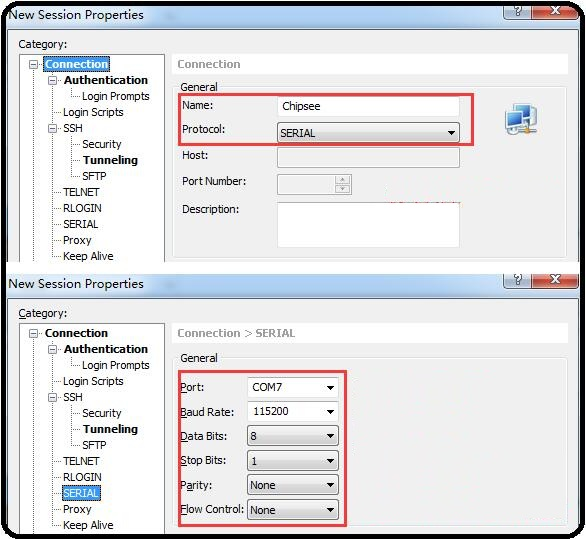
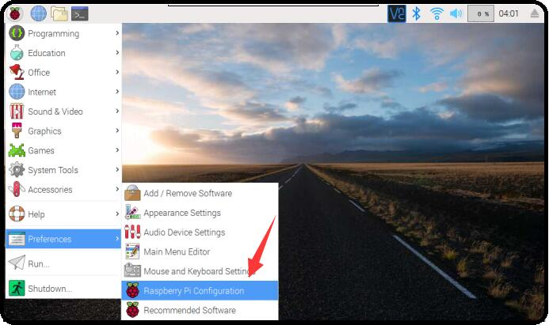
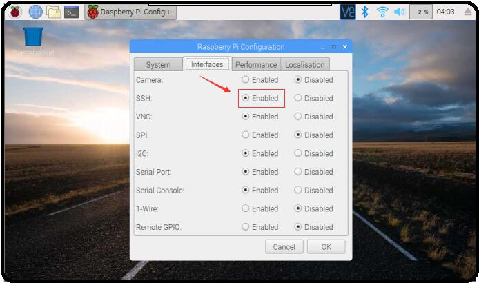
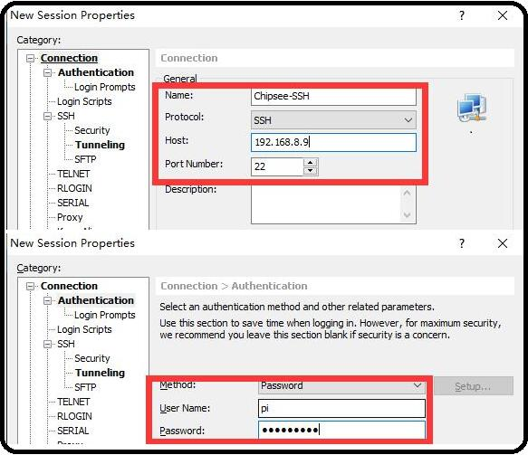
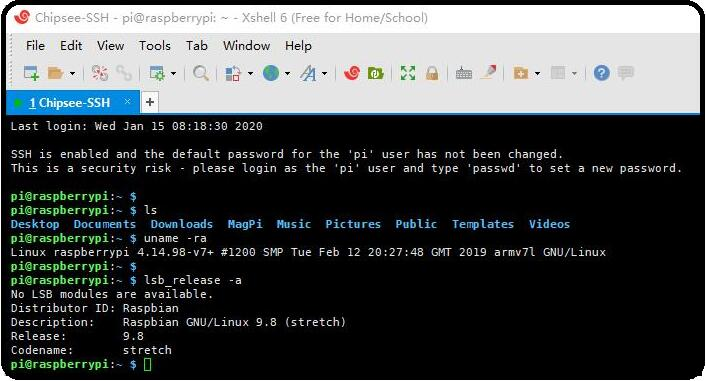

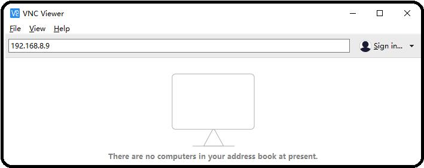
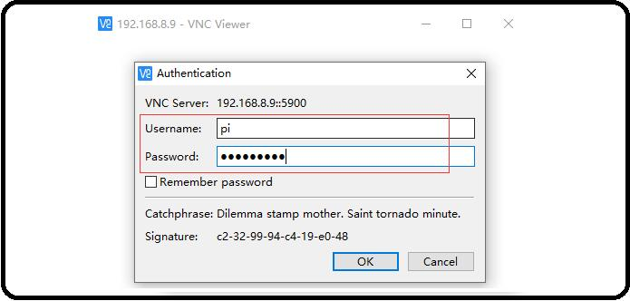
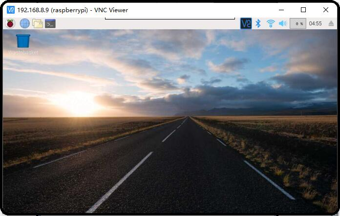
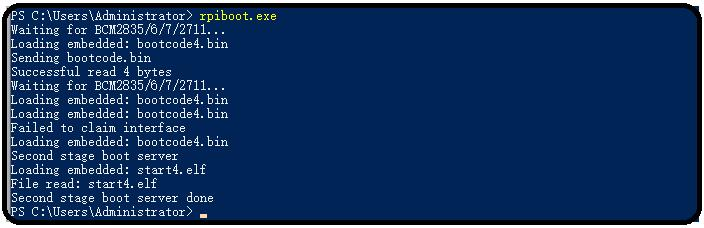
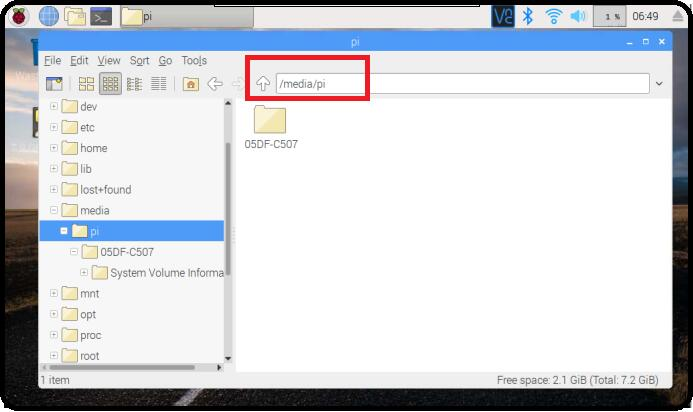
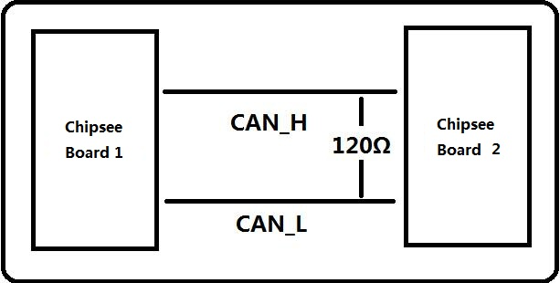
